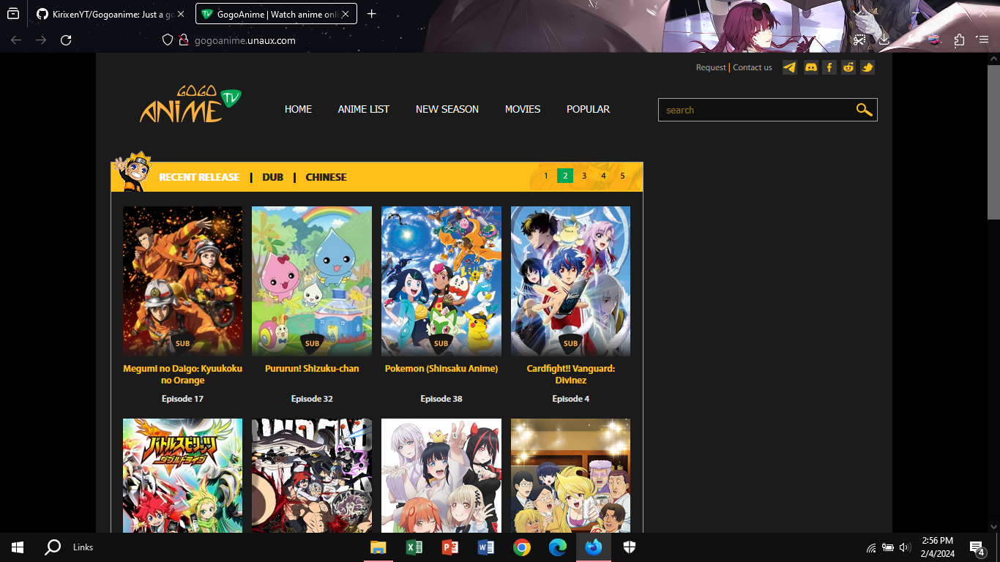
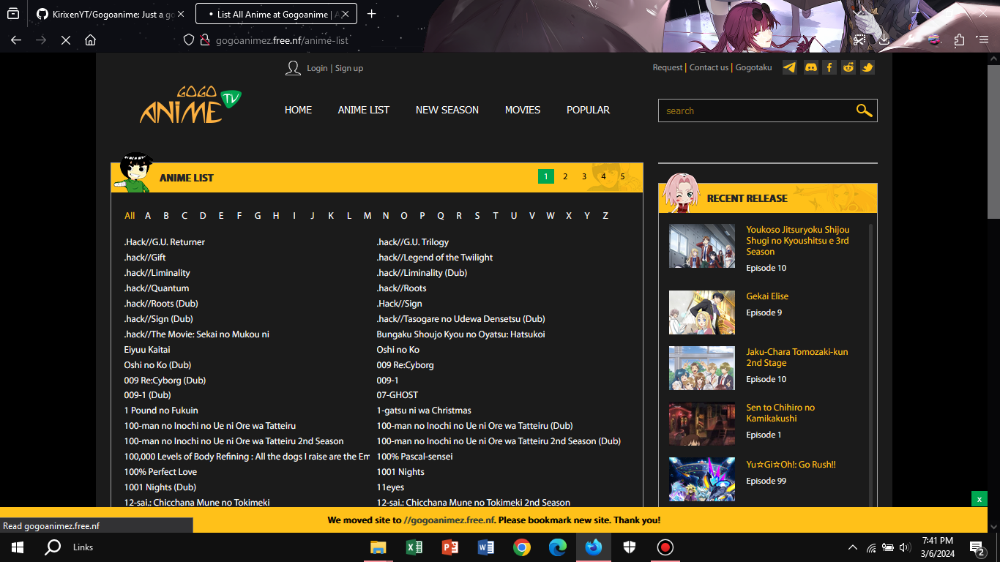
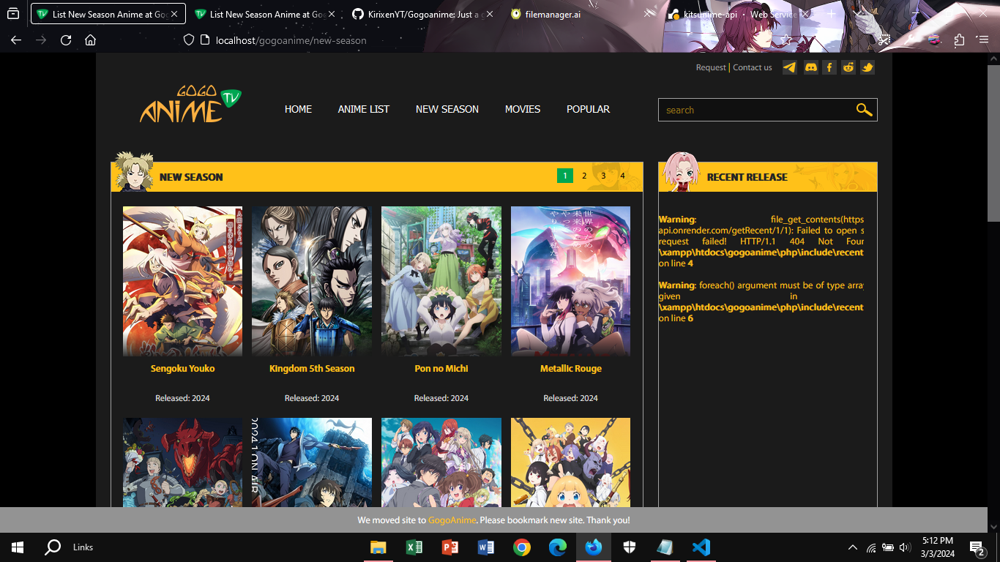
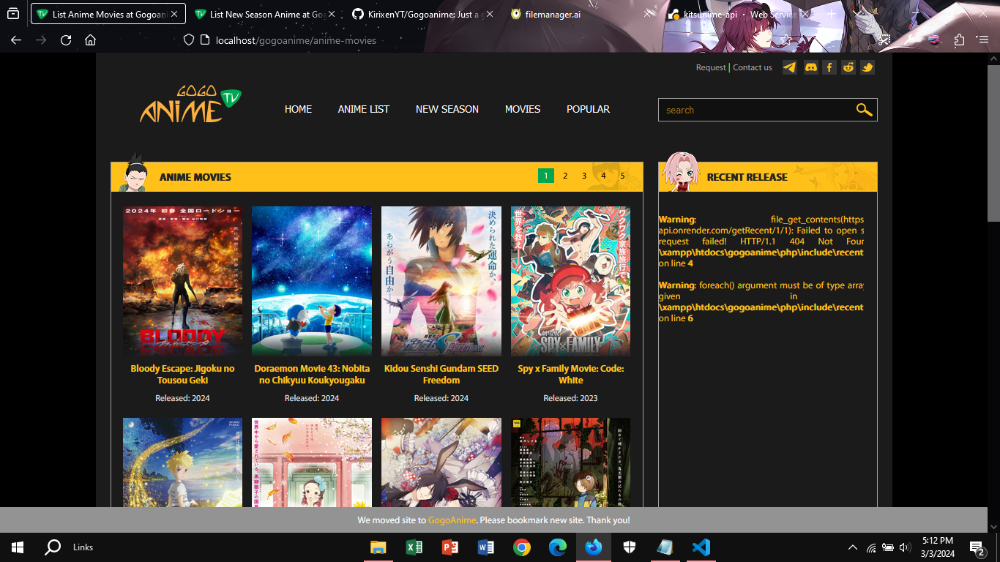
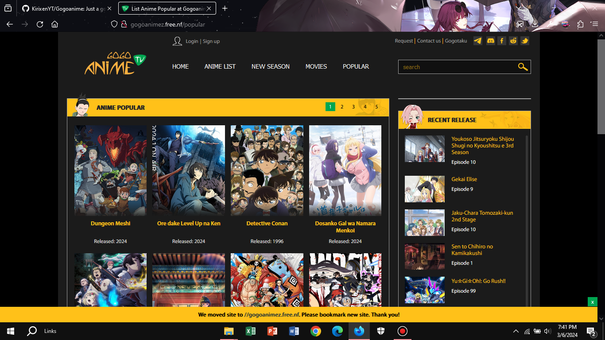
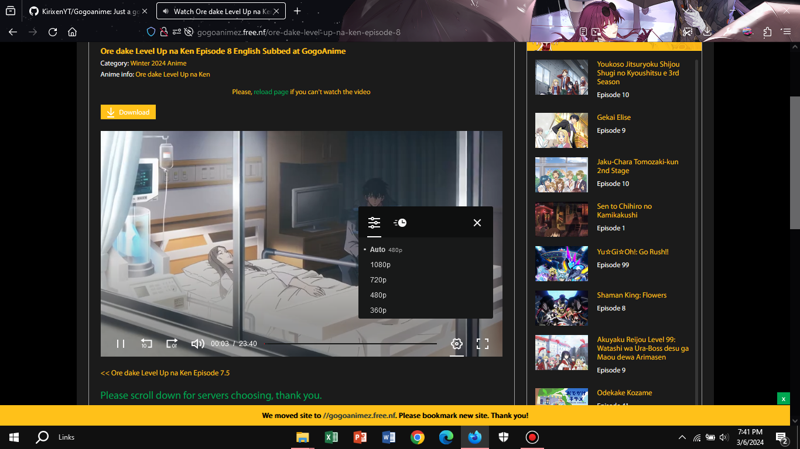

<details>
<summary>Homepage</summary>
<p align="center">
  
</p>
</details>

<details>
<summary>Animelist</summary>
<p align="center">
  
</p>
</details>

<details>
<summary>Season</summary>
<p align="center">
  
</p>
</details>

<details>
<summary>Movies</summary>
<p align="center">
  
</p>
</details>

<details>
<summary>Popular</summary>
<p align="center">
  
</p>
</details>

<details>
<summary>Streaming</summary>
<p align="center">
  
</p>
</details>

[](https://discord.gg/BgTWqFnEss)
<hr/>


## Features 
--> Easy to use <br>
--> Requires no database<br>
--> Responsive<br>
--> Anime Available Based on Genres<br>
--> and many moreeee...

## Acknowledgements

[anime-api](https://github.com/kirixenyt/anime-api) The api used for the need of this website. 

## Requirements
--> Php environment (use .htaccess must be enabled in localhost) or Directly Upload the code on php supported hosting (No editing Required Just Upload and Enjoy)

php/info.php
```
<?php 
$base_url = "//{$_SERVER['SERVER_NAME']}";
$website_name = "GogoAnime"; // The name u want for the website
$apiLink = ""; // Go here https://github.com/KirixenYT/anime-api and host one, and paste the link without the '/' at the end
$consumet = ""; // host ur own consumet api from here `https://github.com/consumet/api.consumet.org` and paste the api here without the `/` at the end
if (date("d") > 15){
    $apiLink = ""; // same for here
}
?>
```

## Online Deployment

Or you can deploy on any php hosting such as <a href="https://www.infinityfree.net/">InfinityFree</a>

## Local Deployment

You need to have `php` installed on your pc for following the intructions

First download the repository using
```
git clone https://github.com/KirixenYT/Gogoanime
```

Now start the production build of the site using
```
php -S localhost:8888
```

This will start the app on http://localhost:8888 <br>
Make Sure You Edit $base_url in php/info.php before starting in localhost.. <br>
And Enable the use of .htaccess in PHP enviornment
